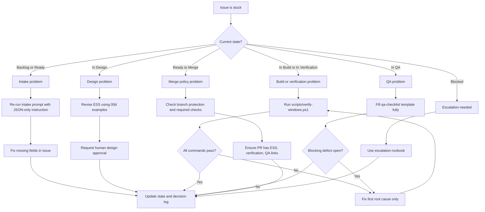

# Troubleshooting Flowchart (Workshop Recovery)

Use this file when a step fails and you are unsure what to do next.

## Before You Start

14 gives the execution path. This file gives recovery routing when a gate fails.

## Decision tree



## Fast recovery commands

Verification reset:

```powershell
powershell -ExecutionPolicy Bypass -File .\scripts\verify-windows.ps1
```

Check git branch and status:

```powershell
git branch --show-current
git status
```

## Copilot output recovery

If Copilot returns markdown instead of JSON, retry with:

```text
Return raw JSON only. No markdown. Follow schema exactly.
```

If response is still invalid after two retries:

- set State = Blocked
- escalate using escalation-runbook

## Next step

After recovery, resume exactly from the failed gate in 14. Do not skip forward.